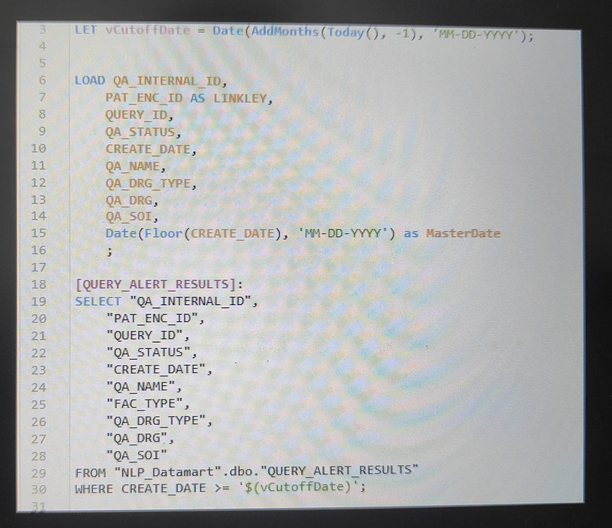
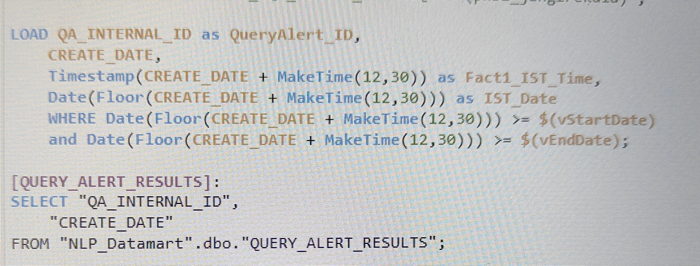

# 🔷 📁 MINI PROJECT 2

#### 📌 Title

## 🔧 Challenges & Solutions : Timezone Standardization Across Multiple Fact Tables

#### 📌 Problem

The project involved two fact tables containing timestamp data in different timezones:

* One table in **UTC**
* Another in **US Mountain Standard Time (MST)**

For accurate reporting, both tables needed to be filtered and analyzed using a **common timezone (IST)**.

Without standardization, applying date filters resulted in **inconsistent and incorrect data across tables**.

---

#### ⚠️ Root Cause

* Different source systems stored timestamps in different timezones
* Direct filtering caused **date misalignment** between datasets
* Events from the same time period appeared under different dates
* No unified time reference for reporting

---

#### ⚙️ Solution Approach

To ensure consistency in reporting:

* Standardized both datasets into a **single timezone (IST)**

* Applied timezone conversions:

  * UTC → IST (**+5 hours 30 minutes**)
  * MST → IST (**+12 hours 30 minutes**)

* Performed conversion:

  * Either at **SQL level** during data extraction
  * Or within **Qlik transformation layer**

* Ensured all date filters were applied **only after conversion to IST**

---

#### 🧪 Implementation (Conceptual)

```qlik
LOAD QA_INTERNAL_ID as QueryAlert_ID,
     CREATE_DATE,
     TimeStamp(CREATE_DATE + MakeTime(12,30)) as CREATE_DATE_IST_Time,
     Date(Floor(CREATE_DATE + MakeTime(12,30)) as IST_Date
[QUERY_ALERT_RESULTS]
SELECT * FROM "NLP_Datamart".dbo."QUERY_ALERT_RESULTS"
;
```

* Created standardized timestamp fields (e.g., `IST_Date`)
* Used these fields for all filtering and reporting

---

#### 📈 Outcome

* Achieved **uniform time reference across all tables**
* Eliminated discrepancies in date-based reporting
* Enabled accurate filtering for dashboards
* Improved reliability of time-based KPIs

---

#### 🔄 Before vs After Improvements

**Before:**


* Different timezones (UTC & MST)
* Incorrect date-based reporting
* Events appearing under wrong dates

**After:**


* Standardized all timestamps to IST
* Accurate and consistent date filtering
* Reliable time-based reporting

---

#### 💡 Key Learning

In multi-source data systems, **timezone standardization is critical** before applying any filters.
A unified time reference ensures consistency, accuracy, and reliable analytics.
