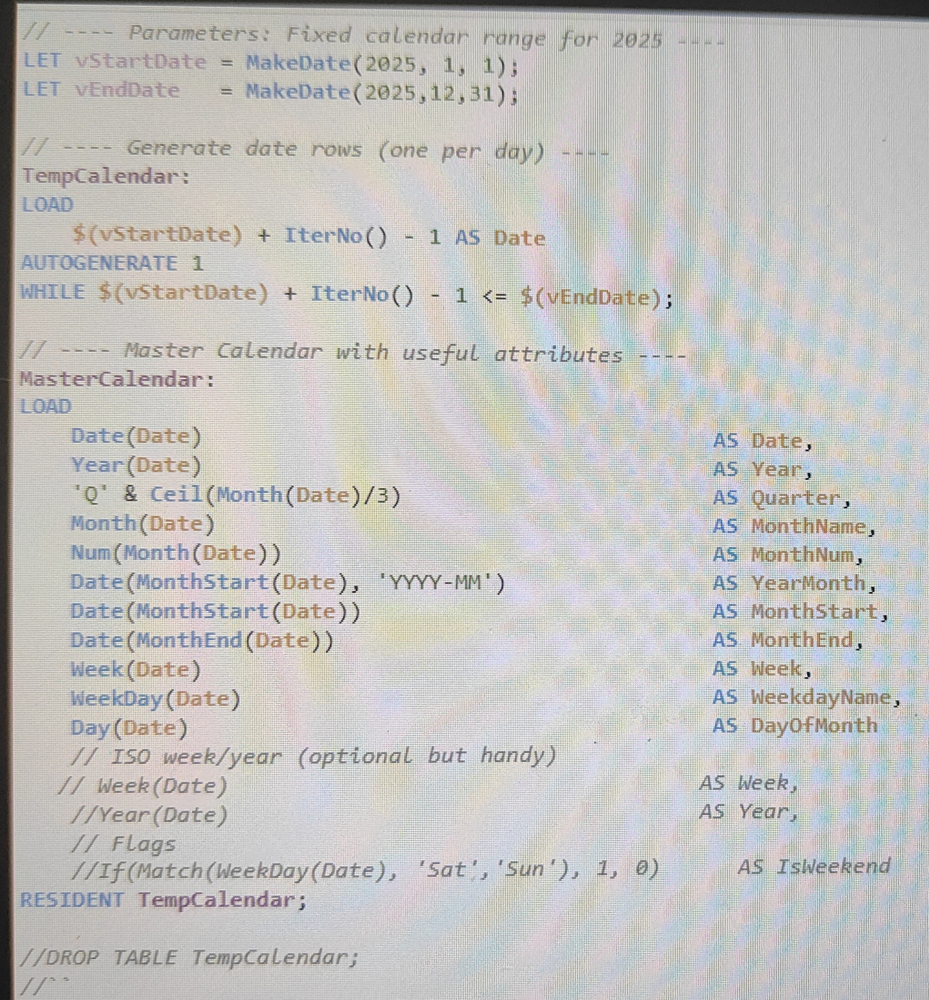
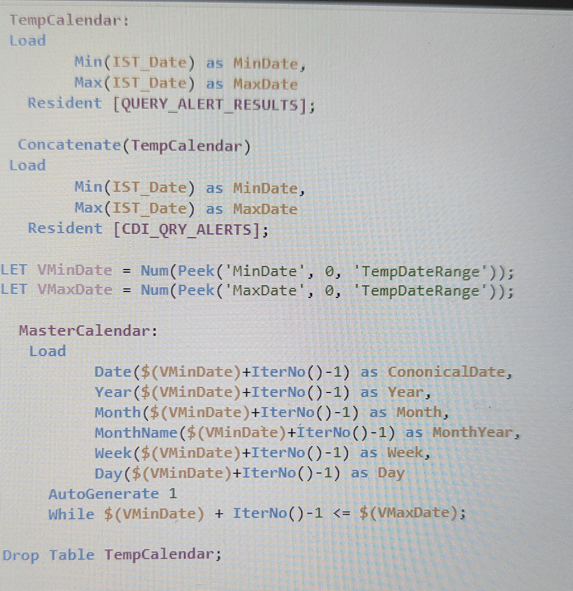

# 🔷 📁 MINI PROJECT 3

#### 📌 Title

## 🔧 Challenges & Solutions : Creating a Master Calendar for Consistent Date Filtering

#### 📌 Problem

The dataset contained multiple records (queries) generated on the same date across multiple fact tables having different date fields,
making it difficult to apply a single date filter across the dashboard.

Directly using these date fields for filtering caused:

* Duplicate date values
* Inconsistent filtering behavior
* Difficulty in applying a single date filter across the dashboard

A **unique and centralized date reference** was required for accurate and consistent filtering.

---

#### ⚠️ Root Cause

* Date fields existed in multiple tables
* Multiple records shared the same date (non-unique values)
* No centralized date dimension to control filtering
* Direct filtering on fact tables led to inconsistent results

---

#### ⚙️ Solution Approach

To resolve this, a **Master Calendar (Date Dimension Table)** was created:

* Generated a **distinct list of dates** covering the required data range

* Created a separate table containing:

  * Unique Date
  * Year
  * Month
  * Day
  * Week

* Linked the Master Calendar to fact tables using the **date field**

* Ensured all dashboard filters used the **Master Calendar date field** instead of individual table dates

---

#### 🧪 Implementation (Conceptual - Qlik)

```qlik
ALLDates:
Load Distinct IST_Date Resident QUERY_ALERT_RESULTS;

Concatenate (ALLDates)
Load Distinct IST_Date Resident CDI_QRY_ALERTS;

Master_Calendar:
Load
    IST_Date,
    Year(IST_Date) as Year,
    Month(IST_Date) as Month,
    MonthName(IST_Date) as MonthYear,
    Week(IST_Date) as Week,
    Day(IST_Date) as Day
Resident ALLDates;

Drop Table ALLDates;
```

* Used the standardized **`IST_Date`** for consistency
* Established relationship between Master Calendar and all relevant tables

---

#### 📈 Outcome

* Enabled **single, consistent date filter** across the dashboard
* Eliminated duplicate date issues
* Improved usability of time-based analysis
* Simplified dashboard design and user interaction

---

## 🔄 Before vs After Improvements

**Before:**


* Multiple date fields across tables
* Duplicate and inconsistent filtering

**After:**


* Introduced Master Calendar
* Single unified date filter
* Improved dashboard usability

---

#### 💡 Key Learning

Using a **Master Calendar (date dimension)** is essential in dashboards with multiple records per date.
It ensures clean filtering, better performance, and a consistent user experience.
